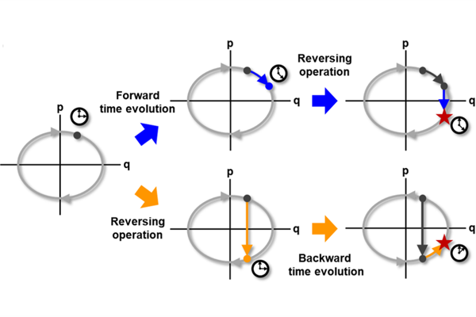

# Time-Reversal Symmetric ODE Network (TRS-ODEN)

In Huh, Eunho Yang, Sung Ju Hwang, and Jinwoo Shin | NeurIPS 2020

Full paper: [arxiv.org/abs/2007.11362](https://arxiv.org/abs/2007.11362)

Time-reversal symmetry, which requires that the dynamics of a system should not change with the reversal of time axis, is a fundamental property that frequently holds in classical and quantum mechanics. In this paper, we propose a novel loss function that measures how well our ordinary differential equation (ODE) networks comply with this time-reversal symmetry; it is formally defined by the discrepancy in the time evolutions of ODE networks between forward and backward dynamics. Then, we design a new framework, which we name as Time-Reversal Symmetric ODE Networks (TRS-ODENs), that can learn the dynamics of physical systems more sample-efficiently by learning with the proposed loss function. We evaluate TRS-ODENs on several classical dynamics, and find they can learn the desired time evolution from observed noisy and complex trajectories. We also show that, even for systems that do not possess the full time-reversal symmetry, TRS-ODENs can achieve better predictive performances over baselines.

## Basic usage

To reproduce the experiments in the paper:
- Experiment I (simple oscillators): `python3 run_exp1.py`
- Experiment II (non-linear oscillators): `python3 run_exp2.py`
- Experiment III (forced oscillators): `python3 run_exp3.py`
- Experiment IV (damped oscillators): `python3 run_exp4.py`
- Experiment V (real-world double oscillators): `python3 run_exp5.py`
- Experiment VI (strange attractors): `python3 run_exp6.py`

To train the models with arbitrary settings:
- with synthetic Duffing oscillator dataset: `python3 train_duffing.py`
- with real-world oscillator dataset: `python3 train_real.py`
- with strange attractor dataset: `python3 train_strange.py`

## Dependencies

- Python 3.6
- Numpy 1.13.3
- Scipy 1.0.0
- Tensorflow 1.12.0
- Keras 2.2.4
